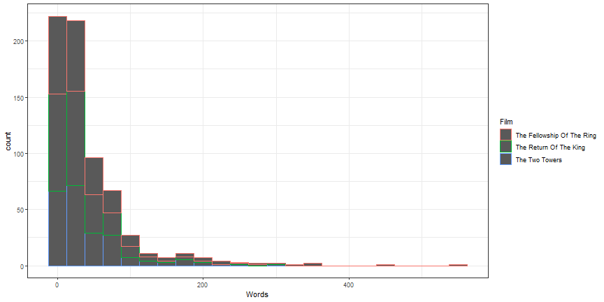

# About Me
- I'm an Assistant Professor in the College of Education
    + I enjoy model building, particularly longitudinal models, and statistical programming.
- I've used R for over 10 years.
    + I have 4 R packages, 3 on CRAN, 1 on GitHub
        * simglm
        * pdfsearch
        * highlightHTML
        * SPSStoR
- GitHub Repository for this workshop: <https://github.com/lebebr01/iowa_data_science>

# Why teach the tidyverse
- The tidyverse is a series of packages developed by Hadley Wickham and his team at RStudio. <https://www.tidyverse.org/>
- I teach/use the tidyverse for 3 major reasons:
    + Simple functions that do one thing well
    + Consistent implementations across functions within tidyverse (i.e. common APIs)
    + Provides a framework for data manipulation
    

# Course Setup


```r
install.packages("tidyverse")
```


```r
library(tidyverse)
```

# Explore Data
# A tibble: 6 x 28
    PID county    state  area poptotal popdensity popwhite popblack
  <int> <chr>     <chr> <dbl>    <int>      <dbl>    <int>    <int>
1   561 ADAMS     IL    0.052    66090      1271.    63917     1702
2   562 ALEXANDER IL    0.014    10626       759      7054     3496
3   563 BOND      IL    0.022    14991       681.    14477      429
4   564 BOONE     IL    0.017    30806      1812.    29344      127
5   565 BROWN     IL    0.018     5836       324.     5264      547
6   566 BUREAU    IL    0.05     35688       714.    35157       50
# ... with 20 more variables: popamerindian <int>, popasian <int>,
#   popother <int>, percwhite <dbl>, percblack <dbl>, percamerindan <dbl>,
#   percasian <dbl>, percother <dbl>, popadults <int>, perchsd <dbl>,
#   percollege <dbl>, percprof <dbl>, poppovertyknown <int>,
#   percpovertyknown <dbl>, percbelowpoverty <dbl>,
#   percchildbelowpovert <dbl>, percadultpoverty <dbl>,
#   percelderlypoverty <dbl>, inmetro <int>, category <chr>

# First ggplot

```r
ggplot(data = midwest) +
  geom_point(mapping = aes(x = popdensity, y = percollege))
```


# Equivalent Code

```r
ggplot(midwest) +
  geom_point(aes(x = popdensity, y = percollege))
```


# Your Turn
1. Try plotting `popdensity` by `state`.
2. Try plotting `county` by `state`. 
    + Does this plot work?
3. Bonus: Try just using the `ggplot(data = midwest)` from above. 
    + What do you get? 
    + Does this make sense?
    
# Add Aesthetics

```r
ggplot(midwest) +
  geom_point(aes(x = popdensity, y = percollege, color = state))
```


# Global Aesthetics

```r
ggplot(midwest) +
  geom_point(aes(x = popdensity, y = percollege), color = 'pink')
```


# Your Turn
1. Instead of using colors, make the shape of the points different for each state.
2. Instead of color, use `alpha` instead. 
    + What does this do to the plot?
3. Try the following command: `colors()`. 
    + Try a few colors to find your favorite.
4. What happens if you use the following code:


```r
ggplot(midwest) + 
  geom_point(aes(x = popdensity, y = percollege, color = 'green'))
```


# Additional Geoms

```r
ggplot(midwest) +
  geom_smooth(aes(x = popdensity, y = percollege))
```


# Add more Aesthetics

```r
ggplot(midwest) +
  geom_smooth(aes(x = popdensity, y = percollege, linetype = state), 
              se = FALSE)
```


# Your Turn
1. It is possible to combine geoms, which we will do next, but try it first. Try to recreate this plot.


# Layered ggplot

```r
ggplot(midwest) +
  geom_point(aes(x = popdensity, y = percollege, color = state)) +
  geom_smooth(aes(x = popdensity, y = percollege, color = state), 
              se = FALSE)
```


# Remove duplicate aesthetics

```r
ggplot(midwest, 
       aes(x = popdensity, y = percollege, color = state)) +
  geom_point() +
  geom_smooth(se = FALSE)
```


# Your Turn
1. Can you recreate the following figure?


# Brief plot customization

```r
ggplot(midwest, 
       aes(x = popdensity, y = percollege, color = state)) +
  geom_point() + 
  scale_x_continuous("Population Density", 
                     breaks = seq(0, 80000, 20000)) + 
  scale_y_continuous("Percent College Graduates") + 
  scale_color_discrete("State")
```

# Brief plot customization Output


# Change plot theme

```r
ggplot(midwest, 
       aes(x = popdensity, y = percollege, color = state)) +
  geom_point() +
  geom_smooth(se = FALSE) + 
  theme_bw()
```


# More themes
+ Themes in ggplot2: <http://ggplot2.tidyverse.org/reference/ggtheme.html>
+ Themes from ggthemes package: <https://cran.r-project.org/web/packages/ggthemes/vignettes/ggthemes.html>

# Base plot for reference

```r
p1 <- ggplot(midwest, 
       aes(x = popdensity, y = percollege, color = state)) +
  geom_point() + 
  scale_x_continuous("Population Density", 
                     breaks = seq(0, 80000, 20000)) + 
  scale_y_continuous("Percent College Graduates") + 
  theme_bw()
```


# Add plot title or subtitle

```r
p1 + 
  labs(title = "Percent College Educated by Population Density",
       subtitle = "County level data for five midwest states")
```


# Color Options

```r
p1 + scale_color_grey("State")
```


# Using colorbrewer2.org
+ <http://colorbrewer2.org>


```r
p1 + scale_color_brewer("State", palette = 'Dark2')
```


# Two additional color options
+ viridis: <https://github.com/sjmgarnier/viridis>
+ scico: <https://github.com/thomasp85/scico>

# viridis colors

```r
library(viridis)
p1 + scale_color_viridis(discrete = TRUE)
```


# viridis colors

```r
p1 + scale_color_viridis(option = 'cividis', discrete = TRUE)
```


# Zoom in on a plot

```r
ggplot(data = midwest, 
       aes(x = popdensity, y = percollege, color = state)) +
  geom_point() + 
  scale_x_continuous("Population Density") + 
  scale_y_continuous("Percent College Graduates") + 
  scale_color_discrete("State") + 
  coord_cartesian(xlim = c(0, 15000))
```

# Zoom in on a plot output


# Zoom using `scale_x_continuous` - Bad Practice

```r
ggplot(data = midwest, 
       aes(x = popdensity, y = percollege, color = state)) +
  geom_point() + 
  geom_smooth(se = FALSE) +
  scale_x_continuous("Population Density", limits = c(0, 15000)) + 
  scale_y_continuous("Percent College Graduates") + 
  scale_color_discrete("State")
```

# Comparing output

```
## `geom_smooth()` using method = 'loess' and formula 'y ~ x'
```

```
## Warning: Removed 16 rows containing non-finite values (stat_smooth).
```

```
## Warning: Removed 16 rows containing missing values (geom_point).
```

```
## `geom_smooth()` using method = 'loess' and formula 'y ~ x'
```


# Lord of the Rings Data
- Data from Jenny Bryan: <https://github.com/jennybc/lotr>


```r
lotr <- read_tsv('https://raw.githubusercontent.com/jennybc/lotr/master/lotr_clean.tsv')
```

```
## Parsed with column specification:
## cols(
##   Film = col_character(),
##   Chapter = col_character(),
##   Character = col_character(),
##   Race = col_character(),
##   Words = col_integer()
## )
```

```r
head(lotr)
```

```
## # A tibble: 6 x 5
##   Film                       Chapter                Character Race   Words
##   <chr>                      <chr>                  <chr>     <chr>  <int>
## 1 The Fellowship Of The Ring 01: Prologue           Bilbo     Hobbit     4
## 2 The Fellowship Of The Ring 01: Prologue           Elrond    Elf        5
## 3 The Fellowship Of The Ring 01: Prologue           Galadriel Elf      460
## 4 The Fellowship Of The Ring 02: Concerning Hobbits Bilbo     Hobbit   214
## 5 The Fellowship Of The Ring 03: The Shire          Bilbo     Hobbit    70
## 6 The Fellowship Of The Ring 03: The Shire          Frodo     Hobbit   128
```

# Geoms for single variables

```r
ggplot(lotr, aes(x = Words)) + 
  geom_histogram() + 
  theme_bw()
```

```
## `stat_bin()` using `bins = 30`. Pick better value with `binwidth`.
```


# Customize histogram

```r
ggplot(lotr, aes(x = Words)) + 
  geom_histogram(bins = 20) + 
  theme_bw()
```


# Customize histogram 2

```r
ggplot(lotr, aes(x = Words)) + 
  geom_histogram(binwidth = 25) + 
  theme_bw()
```


# Histograms by other variables - likely not useful

```r
ggplot(lotr, aes(x = Words, color = Film)) + 
  geom_histogram(binwidth = 25) + 
  theme_bw()
```



# Histograms by other variables - one alternative

```r
ggplot(lotr, aes(x = Words)) + 
  geom_histogram(binwidth = 25) + 
  theme_bw() + 
  facet_wrap(~ Film)
```


# Your Turn
1. With more than two groups, histograms are difficult to interpret due to overlap. Instead, use the `geom_density` to create a density plot for `Words` for each film.

2. Using `geom_boxplot`, create boxplots with `Words` as the y variable and `Film` as the x variable. Bonus: facet this plot by the variable `Race`. Bonus2: Zoom in on the bulk of the data.


# Rotation of axis labels

```r
ggplot(lotr, aes(x = Film, y = Words)) + 
  geom_boxplot() + 
  facet_wrap(~ Race) + 
  theme_bw() + 
  theme(axis.text.x = element_text(angle = 90))
```


# Many times `coord_flip` is better

```r
ggplot(lotr, aes(x = Film, y = Words)) + 
  geom_boxplot() + 
  facet_wrap(~ Race) + 
  theme_bw() + 
  coord_flip()
```


# Bar graphs

```r
ggplot(lotr, aes(x = Race)) + 
  geom_bar() + 
  theme_bw()
```


# Add aesthetic

```r
ggplot(lotr, aes(x = Race)) +
  geom_bar(aes(fill = Film)) + 
  theme_bw()
```


# Stacked Bars Relative

```r
ggplot(lotr, aes(x = Race)) + 
  geom_bar(aes(fill = Film), position = 'fill') + 
  theme_bw() + 
  ylab("Proportion")
```


# Dodged Bars

```r
ggplot(lotr, aes(x = Race)) + 
  geom_bar(aes(fill = Film), position = 'dodge') + 
  theme_bw()
```


# Change Bar Col bar_coloror

```r
ggplot(lotr, aes(x = Race)) + 
  geom_bar(aes(fill = Film), position = 'fill') + 
  theme_bw() + 
  ylab("Proportion") + 
  scale_fill_viridis(option = 'cividis', discrete = TRUE)
```


# Your Turn
1. Using the gss_cat data, create a bar chart of the variable `partyid`.
2. Add the variable `marital` to the bar chart created in step 1. Do you prefer a stacked or dodged version?
3. Take steps to make one of the plots above close to publication quality.


# Additional ggplot2 resources
+ ggplot2 website: <http://docs.ggplot2.org/current/index.html>
+ ggplot2 book: <http://www.springer.com/us/book/9780387981413>
+ R graphics cookbook: <http://www.cookbook-r.com/Graphs/>

# Additional R Resources
+ R for Data Science: <http://r4ds.had.co.nz/>

# Moving to Interactive Graphics
* Why interactive graphics?
    + Created specifically for the web.
    + Can focus, explore, zoom, or remove data at will.
    + Allows users to customize their experience.
    + It is fun!

# Interactive graphics with plotly

```r
install.packages("plotly")
```

# First Interactive Plot

```r
library(plotly)
p <- ggplot(data = midwest) +
  geom_point(mapping = aes(x = popdensity, y = percollege))
print(ggplotly(p))
```

# Customized Interactive Plot

```r
p <- ggplot(midwest, 
       aes(x = popdensity, y = percollege, color = state)) +
  geom_point() + 
  scale_x_continuous("Population Density", 
                     breaks = seq(0, 80000, 20000)) + 
  scale_y_continuous("Percent College Graduates") + 
  scale_color_discrete("State") + 
  theme_bw()
print(ggplotly(p))
```

# Your Turn
1. Using the `starwars` data, create a static ggplot and use the `ggplotly` function to turn it interactive. 

# Lord of the Rings Data
- Data from Jenny Bryan: <https://github.com/jennybc/lotr>


```r
lotr <- read_tsv('https://raw.githubusercontent.com/jennybc/lotr/master/lotr_clean.tsv')
```

```
## Parsed with column specification:
## cols(
##   Film = col_character(),
##   Chapter = col_character(),
##   Character = col_character(),
##   Race = col_character(),
##   Words = col_integer()
## )
```

```r
lotr
```

```
## # A tibble: 682 x 5
##    Film                       Chapter                Character Race  Words
##    <chr>                      <chr>                  <chr>     <chr> <int>
##  1 The Fellowship Of The Ring 01: Prologue           Bilbo     Hobb~     4
##  2 The Fellowship Of The Ring 01: Prologue           Elrond    Elf       5
##  3 The Fellowship Of The Ring 01: Prologue           Galadriel Elf     460
##  4 The Fellowship Of The Ring 02: Concerning Hobbits Bilbo     Hobb~   214
##  5 The Fellowship Of The Ring 03: The Shire          Bilbo     Hobb~    70
##  6 The Fellowship Of The Ring 03: The Shire          Frodo     Hobb~   128
##  7 The Fellowship Of The Ring 03: The Shire          Gandalf   Wiza~   197
##  8 The Fellowship Of The Ring 03: The Shire          Hobbit K~ Hobb~    10
##  9 The Fellowship Of The Ring 03: The Shire          Hobbits   Hobb~    12
## 10 The Fellowship Of The Ring 04: Very Old Friends   Bilbo     Hobb~   339
## # ... with 672 more rows
```

# Create plotly by hand

```r
plot_ly(lotr, x = ~Words) %>% add_histogram() %>% print()
```

# Subplots

```r
one_plot <- function(d) {
  plot_ly(d, x = ~Words) %>%
    add_histogram() %>%
    add_annotations(
      ~unique(Film), x = 0.5, y = 1, 
      xref = "paper", yref = "paper", showarrow = FALSE
    )
}

lotr %>%
  split(.$Film) %>%
  lapply(one_plot) %>% 
  subplot(nrows = 1, shareX = TRUE, titleX = FALSE) %>%
  hide_legend() %>% print()
```


# Grouped bar plot

```r
plot_ly(lotr, x = ~Race, color = ~Film) %>% add_histogram() %>% print()
```

# Plot of proportions

```r
# number of diamonds by cut and clarity (n)
lotr_count <- count(lotr, Race, Film)
# number of diamonds by cut (nn)
lotr_prop <- left_join(lotr_count, count(lotr_count, Race, wt = n))
lotr_prop %>%
  mutate(prop = n / nn) %>%
  plot_ly(x = ~Race, y = ~prop, color = ~Film) %>%
  add_bars() %>%
  layout(barmode = "stack") %>% print()
```

# Your Turn
1. Using the `gss_cat` data, create a histrogram for the `tvhours` variable. 
2. Using the `gss_cat` data, create a bar chart showing the `partyid` variable by the `marital` status.

# Scatterplots by Hand

```r
plot_ly(midwest, x = ~popdensity, y = ~percollege) %>%
  add_markers() %>% print()
```

# Change symbol

```r
plot_ly(midwest, x = ~popdensity, y = ~percollege) %>%
  add_markers(symbol = ~state) %>% print()
```

# Change color

```r
plot_ly(midwest, x = ~popdensity, y = ~percollege) %>%
  add_markers(color = ~state, colors = viridis::viridis(5)) %>% print()
```

# Line Graph

```r
storms_yearly <- storms %>%
  group_by(year) %>%
  summarise(num = length(unique(name)))

plot_ly(storms_yearly, x = ~year, y = ~num) %>%
  add_lines() %>% print()
```

# Your Turn
1. Using the `gss_cat` data, create a scatterplot showing the `age` and `tvhours` variables.
2. Compute the average time spent watching tv by year and marital status. Then, plot the average time spent watching tv by year and marital status.

# Highcharter; Highcharts for R

```r
devtools::install_github("jbkunst/highcharter")
```

# `hchart` function

```r
library(highcharter)

lotr_count <- lotr %>%
  count(Film, Race)

hchart(lotr_count, "column", hcaes(x = Race, y = n, group = Film)) %>% print()
```

# A second `hchart`

```r
hchart(midwest, "scatter", hcaes(x = popdensity, y = percollege, group = state)) %>% print()
```

# Histogram

```r
hchart(lotr$Words) %>% print()
```

# Your Turn
1. Using the `hchart` function, create a bar chart or histogram with the `gss_cat` data.
2. Using the `hchart` function, create a scatterplot with the `gss_cat` data.

# Build Highcharts from scratch

```r
hc <- highchart() %>%
  hc_xAxis(categories = lotr_count$Race) %>%
  hc_add_series(name = 'The Fellowship Of The Ring', 
                data = filter(lotr_count, Film == 'The Fellowship Of The Ring')$n) %>% 
  hc_add_series(name = 'The Two Towers', 
                data = filter(lotr_count, Film == 'The Two Towers')$n) %>%
  hc_add_series(name = 'The Return Of The King', 
                data = filter(lotr_count, Film == 'The Return Of The King')$n)
hc %>% print()
```

# Change Chart type

```r
hc <- hc %>%
  hc_chart(type = 'column')
hc %>% print()
```

# Change Colors

```r
hc <- hc %>%
  hc_colors(substr(viridis(3), 0, 7))
hc %>% print()
```

# Modify Axes

```r
hc <- hc %>%
  hc_xAxis(title = list(text = "Race")) %>%
  hc_yAxis(title = list(text = "Number of Words Spoken"),
           showLastLabel = FALSE)
hc %>% print()
```

# Add title, subtitle, move legend

```r
hc <- hc %>%
  hc_title(text = 'Number of Words Spoken in Lord of the Rings Films',
           align = 'left') %>%
  hc_subtitle(text = 'Broken down by <i>Film</i> and <b>Race</b>', 
              align = 'left') %>%
  hc_legend(align = 'right', verticalAlign = 'top', layout = 'vertical',
            x = 0, y = 80) %>%
  hc_exporting(enabled = TRUE)
hc %>% print()
```


# Your Turn
1. Build up a plot from scratch, getting the figure close to publication quality using the `gss_cat` data.

# Correlation Matrices

```r
select(storms, wind, pressure, ts_diameter, hu_diameter) %>%
  cor(use = "pairwise.complete.obs") %>%
  hchart() %>% print()
```

# Leaflet Example

```r
library(leaflet)

storms %>%
  filter(name %in% c('Ike', 'Katrina'), year > 2000) %>%
  leaflet() %>%
  addTiles() %>%
  addCircles(lng = ~long, lat = ~lat, popup = ~name, weight = 1,
             radius = ~wind*1000) %>% print()
```


# Additional Resources
* plotly for R book: <https://plotly-book.cpsievert.me/>
* plotly: <https://plot.ly/>
* highcharter: <http://jkunst.com/highcharter/index.html>
* highcharts: <https://www.highcharts.com/>
* htmlwidgets: <https://www.htmlwidgets.org/>

